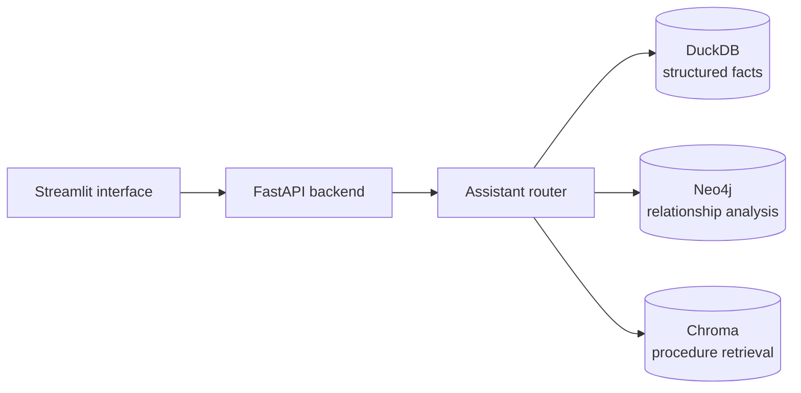

# Freight Visibility AI Assistant

A local, self contained tool for freight operations teams. It brings
shipment status, delay and risk analytics, relationship context across
carriers and routes, and standard operating procedure (SOP) guidance into
a single interface backed by a single API.

## Project summary

Freight operations teams track shipments across many carriers, lanes, and
customers at once. When a shipment is delayed or flagged with an
exception, the person resolving it needs fast answers spread across
several sources: shipment records, event logs, carrier performance data,
and written SOPs. This project combines three complementary data sources
behind one assistant so those answers are available from a single
question:

- **DuckDB** holds the structured shipment, carrier, customer, route,
  event, and exception facts.
- **Neo4j** holds the same entities as a graph, so relationship questions
  (what else is connected to this shipment, what else looks like it, what
  happened last time) do not require several manual joins.
- **Chroma** holds the SOP and FAQ documents as searchable text, so
  procedure guidance for a given disruption can be retrieved directly.

All data is synthetic and generated locally with a fixed random seed. The
assistant router is deterministic rather than model driven: it maps a
question to a route using keyword and shipment ID pattern matching, and
SOP answers are retrieved text rather than generated text.

## Key capabilities

- **Shipment lookup**: status, route, dates, and the full event timeline
  for a specific shipment.
- **Delay and risk analytics**: delay rate and average delay days by
  carrier and lane, and a surfaced list of high risk shipments (delayed,
  flagged with an exception, or on a historically high delay lane).
- **Connected shipment explanation**: a shipment's carrier, customer,
  route, ordered events, and exception in one answer, using the Neo4j
  graph.
- **Similar shipment discovery**: other shipments sharing the same
  carrier and route.
- **Exception precedent analysis**: prior shipments with the same
  exception type on the same carrier or route.
- **Operating procedure retrieval**: SOP and FAQ text relevant to a
  question or a confirmed exception type, retrieved from the Chroma
  vector store.

A Streamlit interface covers all of the above, backed by the FastAPI
service.

## Architecture



- **Streamlit** (`app/ui`) calls the FastAPI service over HTTP and
  performs no data access or business logic of its own.
- **FastAPI** (`app/api`) exposes shipment, analytics, and assistant
  endpoints, delegating each to a service module.
- **Assistant router** (`app/services/assistant_service.py`) uses
  keyword and shipment ID pattern matching to route a question to one of
  nine routes, then calls the corresponding service.
- **DuckDB** (`app/db`, `app/services/shipment_service.py`) is the source
  of truth for shipment, carrier, customer, route, event, and exception
  facts, and confirms a shipment exists before Neo4j or Chroma are
  called.
- **Neo4j** (`app/graph`) holds the same entities as a graph for
  relationship traversal: connected shipment context, peer shipments,
  and exception precedents. A `/health/graph` endpoint reports its status
  independently, and the API starts normally when Neo4j is unavailable.
- **Chroma** (`app/rag`) stores SOP and FAQ documents, chunked and
  embedded with a Sentence Transformers model, for direct text
  retrieval.

Full component and data flow details are in
[docs/ARCHITECTURE.md](docs/ARCHITECTURE.md).

### API endpoints

- `GET /health`
- `GET /health/graph`
- `GET /shipments/{shipment_id}`
- `GET /shipments/{shipment_id}/events`
- `GET /analytics/delay-rates`
- `GET /analytics/high-risk-shipments?limit=50`
- `POST /assistant/sop-search` (request body: `{"question": "..."}`)
- `POST /assistant/chat` (request body: `{"question": "..."}`)

## Example workflow

**Question:** "Why is SHP-1485 delayed?"

**Route selected:** `graph_shipment_explanation`

**Data sources used:** DuckDB confirms the shipment exists, then Neo4j
returns its carrier, customer, route, ordered events, and exception.

**Result:** Shipment SHP-1485 shipped from Oakland, CA to New York, NY
with Canyon Trucking. It is delivered six days late because of a high
severity customs hold exception detected shortly after pickup. The
response also includes the four event records for the shipment and the
resolution status of the exception.

## Verified quality

- 130 automated tests passed (`pytest -q`), 0 failed.
- A labeled evaluation set of 54 questions, covering all nine assistant
  routes, reports:
  - Routing accuracy: 100.0 percent.
  - Shipment ID extraction accuracy: 100.0 percent.
  - SOP source hit rate: 100.0 percent, across 10 questions with an
    expected source document.

These results apply to the synthetic dataset and labeled evaluation
questions included in this repository, not to real freight data or
unlabeled questions. Run the evaluation with:

```bash
python evaluation/evaluate.py
```

It reports routing accuracy, shipment ID extraction accuracy, SOP source
hit rate, route confusion counts, and any failed cases, and exits with a
nonzero status if a result falls below its documented threshold.

## Technology stack

**Backend**
FastAPI, Uvicorn, Pydantic

**Interface**
Streamlit

**Data and storage**
DuckDB, Neo4j (Community Edition), Chroma

**Retrieval**
Sentence Transformers (`all-MiniLM-L6-v2`)

**Data generation**
NumPy, Pandas

**Testing**
Pytest

Python version: 3.11.

## Setup

### Docker (recommended)

Runs the complete application (FastAPI, Streamlit, and Neo4j) with one
command. Copy `.env.example` to `.env` first and set a real password for
`NEO4J_PASSWORD`.

```bash
docker compose up --build
```

This starts Neo4j, waits for it to become healthy, then runs a one time
setup step that generates synthetic data, builds the DuckDB database,
ingests the SOP documents into Chroma, and loads the Neo4j graph, before
starting the API and the Streamlit UI.

Verify it is running:

```bash
docker compose ps
curl http://127.0.0.1:8000/health
curl http://127.0.0.1:8000/health/graph
curl -I http://127.0.0.1:8501
```

The API is on `http://127.0.0.1:8000` and the Streamlit UI is on
`http://127.0.0.1:8501`.

Stop everything:

```bash
docker compose down
```

This stops and removes the containers but keeps the named volumes, so
the generated data, Chroma store, and Neo4j graph are still there the
next time you run `docker compose up --build`.

### Local Python

Run these steps in order from the project root.

```bash
python3 -m venv .venv
source .venv/bin/activate
pip install --upgrade pip
pip install -r requirements.txt
```

No environment variables are required for local use (see
`.env.example`).

```bash
# 1. Generate synthetic data (writes CSVs to data/processed/)
python -m app.data.generate_synthetic_data

# 2. Build the DuckDB database (data/processed/logistics.duckdb)
python -m app.data.load_data

# 3. Ingest SOP documents into Chroma (data/processed/chroma/)
# The first run downloads the embedding model from Hugging Face and
# caches it locally; later runs work offline.
python -m app.rag.ingest_docs

# 4. Start the FastAPI service (http://127.0.0.1:8000)
uvicorn app.api.main:app --reload

# 5. In a separate terminal, with the same virtual environment active,
# start the Streamlit app. It expects the FastAPI service to already be
# running on http://127.0.0.1:8000.
streamlit run app/ui/streamlit_app.py
```

The Neo4j powered graph routes and `/health/graph` require a running
Neo4j instance; start one with `docker compose up -d neo4j`, then load
the graph with `python -m app.graph.load_graph`.

## Repository structure

```text
app/
├── api/          FastAPI app and route modules
├── services/      shipment, analytics, graph, and assistant routing logic
├── db/            DuckDB connection helpers
├── graph/         Neo4j connection, schema, queries, and ingestion
├── rag/           SOP chunking, embedding, and Chroma retrieval
├── data/          synthetic data generation and loading
└── ui/            Streamlit interface

data/
├── processed/     generated CSVs, DuckDB file, Chroma store (not committed)
└── sample_sops/   sample SOP and FAQ markdown documents

docs/              project documentation
tests/             automated test suite
evaluation/        labeled evaluation questions and evaluation script
```

## Limitations

- All shipment, carrier, customer, and route data is synthetic, generated
  locally with a fixed random seed. It does not represent real freight
  data.
- Assistant routing is deterministic, based on keywords and patterns
  rather than a model, so questions phrased outside its known patterns
  may be misrouted.
- SOP retrieval returns matching source text directly rather than
  generating a new answer.
- The system is designed for local, single user use.
- Generated CSVs, the DuckDB database file, and the Chroma vector store
  are local build artifacts and are not committed to version control.
